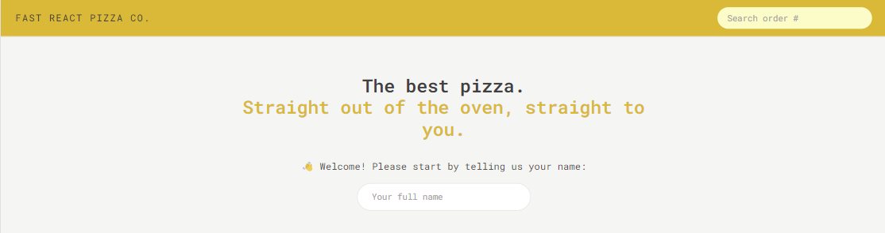
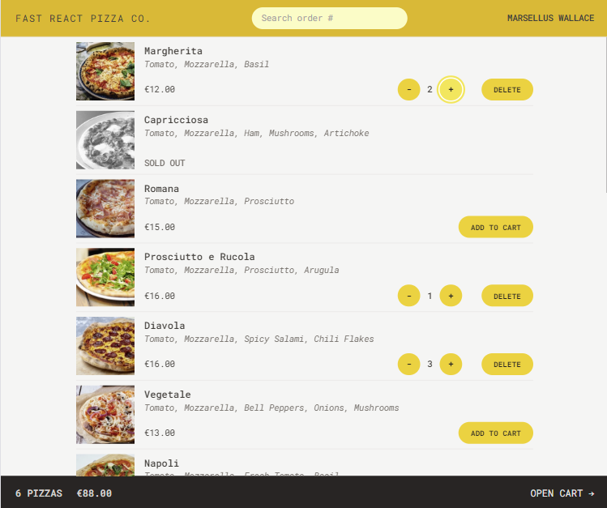
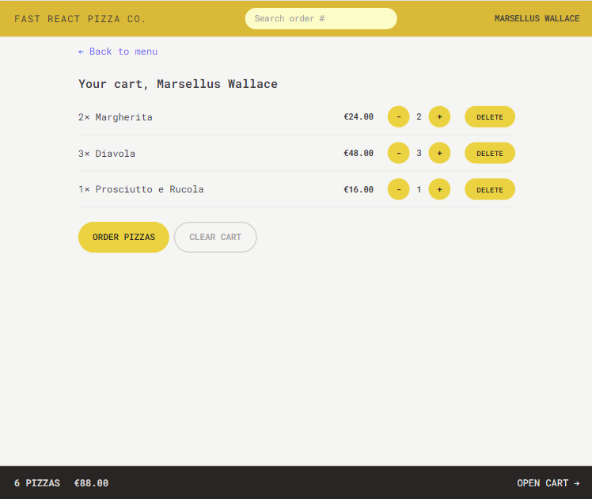
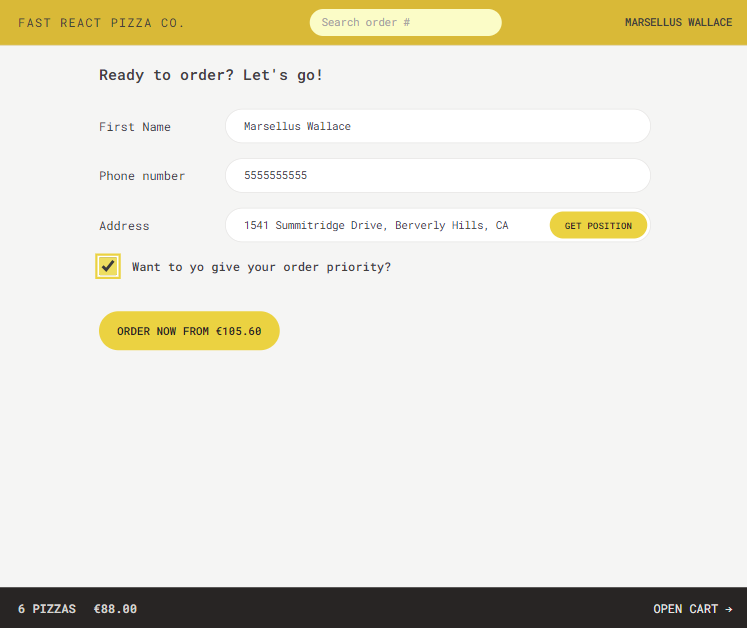
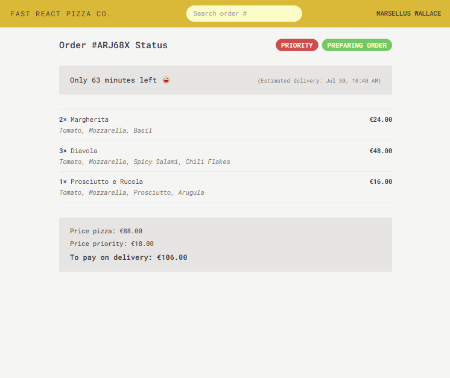

# Fast React Pizza 

  ## Description

  An online Pizza delivery business built with React, Redux, and TailwindCSS.  Utilizes an API for feching menu items.  Order pizzas,  review your order in the cart and enter delivery information with ability to use geolocation to get address.

  ### Deployed URL:  https://billstephens2022.github.io/fast-pizza-react/

  ### App Screenshots
  
  
  
  
  
  
  ## Table of Contents
  
- [Fast React Pizza](#fast-react-pizza)
  - [Description](#description)
  - [Table of Contents](#table-of-contents)
  - [Installation](#installation)
  - [Usage](#usage)
  - [License](#license)
  - [Contributing](#contributing)
  - [Tests](#tests)
  - [Questions](#questions)
  
  ## Installation
  
  npm install
  
  ## Usage
  
  npm run dev

  ## License
This application is covered under the MIT License.
 For more information: https://opensource.org/licenses/MIT
  
  ## Contributing
  N/A
  
  ## Tests
  N/A

  ## Questions
  Contact Info 
  GitHub user name: BillStephens2022 
  Link to GitHub profile: https://github.com/BillStephens2022 
  Email: stephensbill17@gmail.com